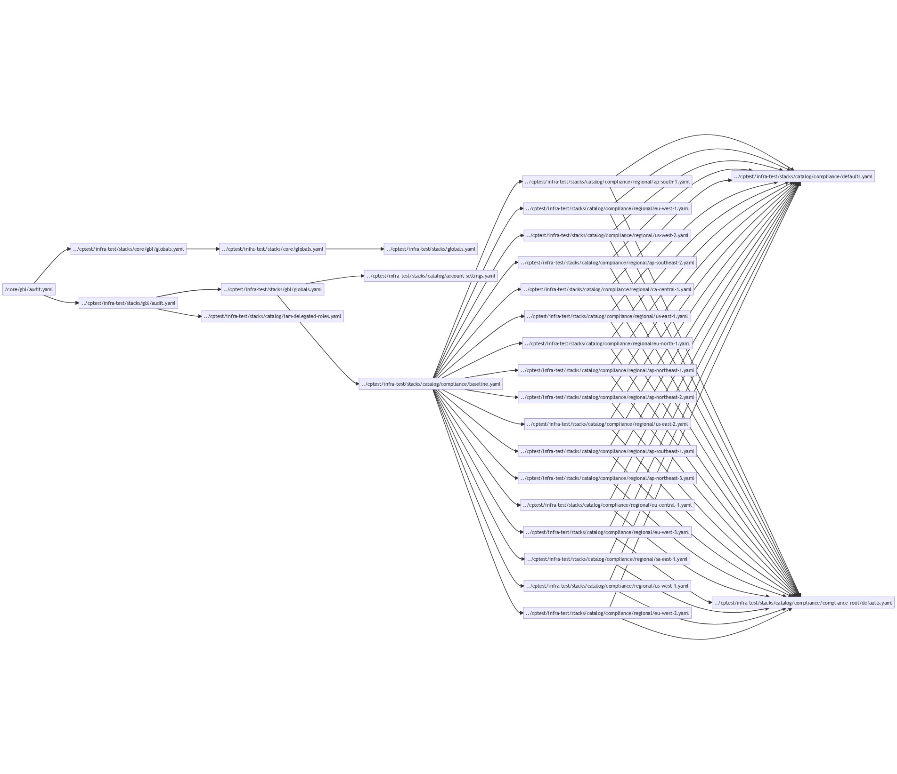

# cp-imports

Outputs Cloud Posse import chains in stack configs. Both text concatenation and mermaid flowcharts. 



```
usage: imports.py [-h] [-d STACK_DIR] [-f FLOWCHART] [-l LOGGING_LEVEL] [-m | --mermaid | --no-mermaid] [-o | --open-mermaid | --no-open-mermaid] stack

positional arguments:
  stack                 stack file to read imports from

optional arguments:
  -h, --help            show this help message and exit
  -d STACK_DIR, --stack-dir STACK_DIR
                        base stack directory name (default: stacks/)
  -f FLOWCHART, --flowchart FLOWCHART
                        https://mermaid-js.github.io/mermaid/#/flowchart?id=flowchart-orientation (default: LR)
  -l LOGGING_LEVEL, --logging-level LOGGING_LEVEL
                        execution logging level (default: info)
  -m, --mermaid, --no-mermaid
                        output mermaid graph (default: False)
  -o, --open-mermaid, --no-open-mermaid
                        open mermaid graph in browser (default: False)
```